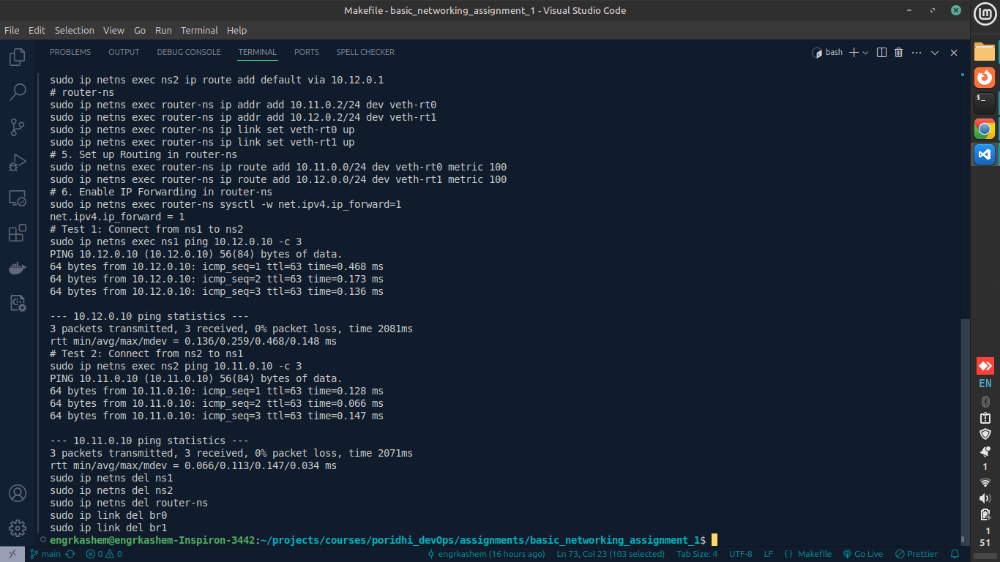
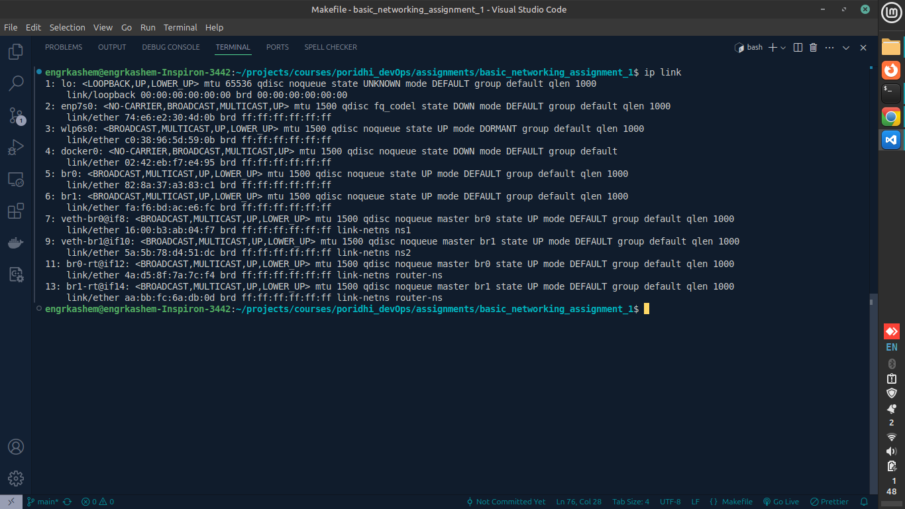
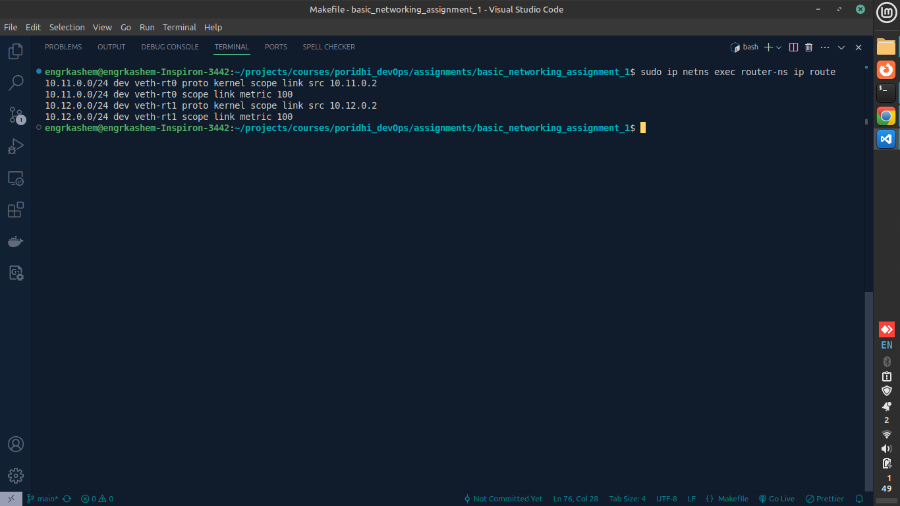

# Basic Computer Networking Assignment-1

This document describes the network namespace setup implemented using a Makefile. It details the network topology, IP addressing scheme, routing configuration, testing procedures, and results.

## 1. Network Diagram


## 2. IP Addressing Scheme

| Resource         | Interface/Namespace | IP Address | Subnet Mask   | Gateway   |
| ---------------- | ------------------- | ---------- | ------------- | --------- |
| Bridge 0         | br0                 | 10.11.0.1  | 255.255.255.0 | N/A       |
| Bridge 1         | br1                 | 10.12.0.1  | 255.255.255.0 | N/A       |
| Namespace 1      | veth-ns1            | 10.11.0.10 | 255.255.255.0 | 10.11.0.1 |
| Namespace 2      | veth-ns2            | 10.12.0.10 | 255.255.255.0 | 10.12.0.1 |
| Router Namespace | veth-rt0            | 10.11.0.2  | 255.255.255.0 | N/A       |
| Router Namespace | veth-rt1            | 10.12.0.2  | 255.255.255.0 | N/A       |

## 3. Routing Configuration

The routing configuration is performed within the `router-ns` namespace. The following routes are added:

- **Destination Network:** `10.11.0.0/24` (Namespace 1 network)
  - **Outgoing Interface:** `veth-rt0`
  - **Metric:** `100`
- **Destination Network:** `10.12.0.0/24` (Namespace 2 network)
  - **Outgoing Interface:** `veth-rt1`
  - **Metric:** `100`

IP forwarding is enabled in the `router-ns` namespace to allow traffic to pass between the two networks:

```bash
    sysctl -w net.ipv4.ip_forward=1
```

## 4. Testing Procedures and Results

Connectivity between ns1 and ns2 is tested using the ping command. The following tests are performed:

- Test 1: Ping from ns1 to ns2:

```bash
    sudo ip netns exec ns1 ping 10.12.0.10 -c 3
```

- Test 2: Ping from ns2 to ns1:

```bash
    sudo ip netns exec ns2 ping 10.11.0.10 -c 3
```

### Expected Results:

**Example Successful Output (Test 1):**




